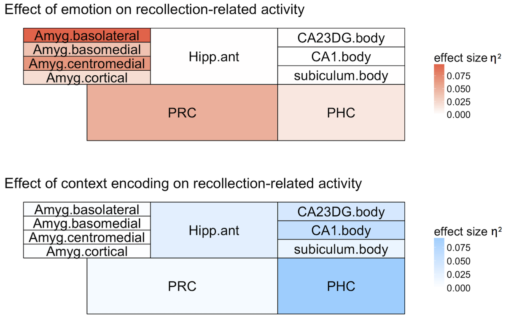

# The paper

This repository includes scripts and data for the following paper:

[**Ritchey, M., Wang, S.-F., Yonelinas, A.P., & Ranganath C. (pre-print). Dissociable medial temporal pathways for encoding emotional item and context information**](https://www.biorxiv.org/content/early/2018/01/15/248294)

# Abstract

Emotional experiences are typically remembered with a greater sense of recollection than neutral experiences, but memory benefits for emotional items do not typically extend to their source contexts. Item and source memory have been attributed to different subregions of the medial temporal lobes (MTL), but it is unclear how emotional item recollection fits into existing models of MTL function and, in particular, what is the role of the hippocampus. To address these issues, we used high-resolution fMRI to examine MTL contributions to successful emotional item and context encoding. The results showed that emotional items were recollected more often than neutral items. Whereas amygdala and PRC activity supported the recollection advantage for emotional items, hippocampal and PHC activity predicted subsequent source memory for both types of items, reflecting a double dissociation between anterior and posterior MTL regions. We next tested whether amygdala activity during encoding modulated the relationship between MTL activity and subsequent memory outcomes. The amygdala and PRC played complementary roles in supporting subsequent item recollection, in that lower amygdala activity was associated with more memory dependence on PRC. In contrast, the amygdala and hippocampus played synergistic roles in supporting subsequent source memory, in that higher amygdala activity amplified the relation of hippocampal activity to subsequent source memory. The results suggest that emotion-related enhancements in item recollection are supported by an amygdala-perirhinal pathway, which is separable from the hippocampal pathway that binds items to their source context.

# Resources

I have shared a few key scripts in the `analysis` folder along with some corresponding data files and reports. All files can be found [here](https://github.com/memobc/paper-memohr).

The general flow of the included scripts is as follows:
- Analyze the behavioral data: `analysis/MemoHR_behavior_paper.Rmd`
    - The formatted report (with code) can be found [here](http://www.thememolab.org/paper-memohr/reports/MemoHR_behavior_paper.nb.html).
    - Data output from this script can be found here: `data/behavior_processedData.Rdata`
- Use the scored behavioral data to generate csv files containing all info necessary to set up fMRI model regressors: `analysis/MemoHR_itemSourceModel_spec.R`
- Use those csv files to generate the SPM regressor & contrast files: `analysis/generate_regs_cons_ItemSource.m`
- Run the model for each subject: `analysis/batch_model_ItemSourceDM.m`
- Extract mean contrast estimates from native-space ROIs: `analysis/output_indivroi_cons_all_new.m`
    - Data output from this script can be found here: `data/cons_ashs_ItemSourceDM_rf_new.csv`
- Run the ROI analyses on those contrast estimates: `analysis/MemoHR_ROI_analysis_paper.Rmd`
    - The formatted report (with code) can be found [here](http://www.thememolab.org/paper-memohr/reports/MemoHR_ROI_analysis_paper.nb.html). This includes code for generating the ROI maps shown above.
    - Data output from this script can be found here: `data/MemoHR_AnatROI_Data_ItemSource.Rdata`
- Run an analysis linking ROI activity to single-trial memory outcomes: `analysis/MemoHR_ROI_analysis_predictmem_paper.Rmd`
    - Single-trial input data can be found here: `data/cons_ashs_betas_ItemSourceDM_rf_new_ST.csv`
    - The formatted report (with code) can be found [here](http://www.thememolab.org/paper-memohr/reports/MemoHR_ROI_analysis_predictmem_paper.nb.html).

PsychoPy task scripts are included in the `task` folder. The practice versions should be runnable with the practice stimuli provided (pictures of my dog and cat, not actually included in the experiment). You can request the actual task stimuli [here](http://lobi.nencki.gov.pl/research/8/).

# Comments?
Please direct any comments to Maureen Ritchey, maureen.ritchey at bc.edu. Notice a bug? Please tell me. Want to use any of these scripts? Go right ahead. Unfortunately I cannot provide any support for you to adapt them to your own data.
